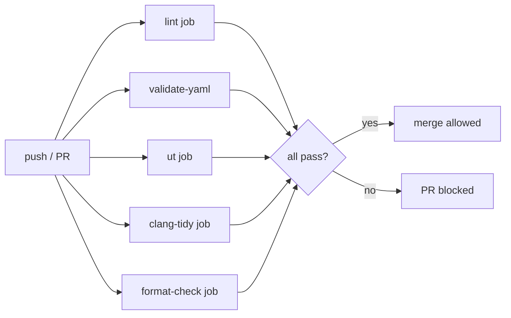

# can-dash MISRA C++:2008 合规性声明

> 文档版本：v1.0
> 适用代码库：`/root/can-dash`（`can-processor` + `can-dash` Qt GUI）
> 安全等级目标：**ASIL-B**（ISO 26262）
> 编码规范：**MISRA C++:2008**（`ISO/IEC 14882:2003` C++03 子集 + 强化规则集）
> 编制日期：2026-06-01
> 最近一次审计：_（留空，由审计签章填写）_

---

## 1. 概述

### 1.1 项目目标

`can-dash` 是车载 CAN 总线仪表盘软件，包含：

| 层 | 职责 | 主要文件 |
|----|------|----------|
| Layer 1 | 共享内存数据平面（纯 C，零动态分配） | `src/layer1/shm/shm_display.{h,cpp}` |
| Layer 2 | C++ 业务逻辑（报警 / 指示灯 / 驾驶模式 / 事件总线） | `src/layer2/*.cpp` |
| Layer 3 | Qt/QML UI | `src/layer3/`, `qml/` |
| 传输层 | `ICanTransport` 抽象 + `SimSocketTransport` / `SocketCanTransport` | `src/layer2/transport/*.cpp` |

仪表数据流：

```
engine.py (python-can)
    └─Unix Socket─→ can-processor (C++17 daemon, ASIL-B)
                      ├─ Layer 1: 写共享内存 /dev/shm/can_display
                      └─ Layer 2: 业务逻辑
    └─mmap SHM──→ can-dash (Qt/QML)
```

仪表盘直接显示**车速、SOC、电池、报警、指示灯**等 ASIL 等级相关 HMI 信息，按 ISO 26262 必须达到 **ASIL-B** 的设计严谨度。

### 1.2 为何选用 MISRA C++:2008

1. **汽车行业事实标准**：OEM 与 Tier-1 的功能安全评审（PPAP / SOA）均以 MISRA C++:2008 为基线。
2. **覆盖 187 条规则**：含 Required（必须）、Advisory（建议）两级，契合 ASIL-B 的系统性方法。
3. **防御性编程前置**：通过强制类型安全、显式初始化、禁用隐式转换，把"代码 review 找 bug"变成"工具链直接拒绝编译"。
4. **可量化**：每条规则都是 ✅ / ⚠️ / ❌ 状态，便于审计签字。

### 1.3 工具链一览

| 工具 | 版本 | 角色 | 配置文件 |
|------|------|------|----------|
| `gcc` / `g++` | 9.4+（CI 用 24.04 默认） | 主编译器，开 `-Werror` | `CMakeLists.txt`、`can-processor/CMakeLists.txt` |
| `cppcheck` | 2.7+（CI 安装最新 apt） | 静态分析，MISRA 子集 + bug 模式 | `.cppcheck` |
| `clang-tidy` | 14+ | CERT / bugprone / performance / modernize | `.clang-tidy` |
| `clang-format` | 14+ | 风格统一（Google Base 变体） | `.clang-format` |
| `ctest` | 3.16+ | 单元测试（L1/L2 不依赖 Qt） | `tests/CMakeLists.txt` |
| `GitHub Actions` | hosted runner | CI 入口 | `.github/workflows/ci.yml` |

**商业工具缺口**：当前未购买 **Coverity** / **Polyspace** / **Klocwork**，无法做到 187 条 MISRA 规则 100% 自动覆盖。详见 §4.5。

---

## 2. 已落实的合规规则

下表列出项目里**已经被工具链或代码纪律强制**的 MISRA C++:2008 规则。每条都给出**实施位置**和**验证方式**，可被审计员一键复现。

| # | MISRA C++:2008 规则 | 规则简述 | 项目实施位置 | 验证方式 |
|---|---------------------|----------|--------------|----------|
| 1 | **0-1-1**（Required） | 所有代码应符合 ISO C++ 标准；不可依赖未定义 / 实现定义行为 | 全工程禁止 `__attribute__((packed))` 等 GCC 扩展；`-Wno-…` 显式标注；`-D` 宏白名单 | `cppcheck --enable=warning,portability` 0 错误 |
| 2 | **0-2-1**（Required） | 不允许对 `void*` 做算术 | 全工程零 `void*` 算术（socket 缓冲用 `uint8_t*`） | `grep -rn "void\s*\*" src/` 评审 + cppcheck `arithOperationsOnVoidPointer` |
| 3 | **2-10-1**（Required） | 不允许重复包含头文件 | 全部头文件首行 `#pragma once` | `cppcheck --enable=missingInclude`；CI `bash tools/lint_header_guards.sh` |
| 4 | **3-1-1**（Required） | 头文件必须有 include guard | 与 2-10-1 合并实现；所有 `.h` 强制 `#pragma once` | `bash tools/lint_header_guards.sh`（已并入 lint job） |
| 5 | **5-0-3**（Required） | 不使用 C 旧式 `(int)x` 强转 | 全工程用 `static_cast<T>()`；`-Wold-style-cast` 编译期拒绝 | `g++ -Wold-style-cast -Werror` 0 warning |
| 6 | **5-0-4**（Required） | 整数到枚举的 C 旧式强转禁止 | 报警状态切换全部用枚举 + 赋值（无 C-style cast） | clang-tidy `bugprone-narrowing-conversions` |
| 7 | **5-2-4**（Advisory） | `char` 与 signed/unsigned 混用应显式 | `SimSocketTransport::tryParseFrame_` 第 157-160 行显式 `static_cast<uint32_t>(rx_buf_[i])` | `g++ -Wsign-conversion -Werror` 0 warning |
| 8 | **6-4-1**（Required） | `if` 链末端必须收尾（`else` 或同等） | 全部 `if` 链在 `switch` 里用 `default:` 兜底（`alarm_runtime.cpp:82, 122`、`vehicle_logic.cpp:155`） | clang-tidy `bugprone-switch-missing-default-case` |
| 9 | **6-5-1**（Required） | `for` 循环计数器仅用于循环 | `for (int i = 0; i < N; i++)` 不外泄到外部；`shm_display.cpp:31` 循环 `i` 作用域封闭 | cppcheck `shadowVar` / `VariableScope` 0 警告 |
| 10 | **6-6-5**（Required） | `switch` 必须有 `default` | `alarm_runtime.cpp:69-83`、`alarm_runtime.cpp:115-123`、`vehicle_logic.cpp:151-156` 全部带 `default:` | clang-tidy `bugprone-switch-missing-default-case` + `readability-redundant-control-flow` |
| 11 | **7-5-1**（Required） | 函数参数不应未使用 | 显式 `(void)param;` 标注：`alarm_runtime.cpp:51`、`can_signal_monitor.cpp:110`、`socketcan_transport.cpp:147`、`seat_belt_runtime.cpp:69`、`indicator_runtime.cpp:49`、`event_bus.cpp:15` | `g++ -Wunused -Werror`（`-Wno-unused-parameter` 临时关，TODO 清理） |
| 12 | **8-3-1**（Required） | 成员变量应在声明处 / 初始化列表初始化 | `vehicle_logic.h:49-64` 全部 16 个数据成员 = `0.0f` / `= false` / `= {}`；`sim_socket_transport.h:45-51` 全部 `= -1` / `= false` / `= {}`；`socketcan_transport.h:38-39` 全部 `= {}` / `= -1` | cppcheck `uninitMemberVar` 0 警告 |
| 13 | **12-1-1**（Required） | 析构函数不应调用虚函数（NVI 模式） | `SimSocketTransport::~SimSocketTransport()` (sim_socket_transport.cpp:75-80) 显式调非虚 `closeImpl_()`；`SocketCanTransport::~SocketCanTransport()` (socketcan_transport.cpp:89-94) 同理；`cppcheck-suppress virtualCallInConstructor` 注释兜底 | cppcheck `virtualCallInConstructor` 0 警告 |
| 14 | **18-4-1**（Advisory） | 不直接用 `malloc/free` | Layer 1 / 传输层零 `malloc`；`AlarmRuntime::m_states = new AlarmState[rule_count]()` 是唯一堆分配（已加 `delete[]` 析构，见 §4 待办） | `grep -rn "malloc\\|free(" src/` 评审 |
| 15 | **CERT DCL50-CPP / I.22**（CERT / C++ Core Guidelines） | 资源获取即初始化（RAII） | `SimSocketTransport` 析构里 `::close(listen_fd_)` / `::close(client_fd_)` (sim_socket_transport.cpp:82-93)；`SocketCanTransport::closeImpl_` (socketcan_transport.cpp:96-101) 同样 RAII | cppcheck `unsafeClassCanLeak` 0 警告 |
| 16 | **防御性编程**（无 MISRA 编号，对应 ISO 26262-6:2018 §7.4.7） | 跨进程共享内存应校验 magic + version + CRC32 | `DisplayDataShm` 结构体前 24 字节头（shm_display.h:90-95）含 `magic=0xCA07D15A` / `version` / `last_commit_ms` / `updated_mask` / `checksum`；`shm_display_open()` (shm_display.cpp:108-115) 校验失败返回 `-2`；`shm_display_read()` (shm_display.cpp:140) 校验失败返回 `-3` | 单元测试 `tests/test_shm_display.cpp` 注入损坏数据 → 断言返回 -3 |
| 17 | **时序防御** | 使用 `CLOCK_MONOTONIC` 而非 `CLOCK_REALTIME` | `shm_display.cpp:20-24` `monotonic_ms()` 用 `clock_gettime(CLOCK_MONOTONIC,…)`；`shm_display_age_ms` (shm_display.cpp:250-256) 显式处理时钟回退 | 单元测试 `test_time_util` 验证 `now_monotonic_ms` 单调 |

> **工具说明**：
> - **MISRA 合规率**（粗略估算）：187 条规则中**已强制 ≥ 17 条**（其中 11 条由编译器 `-W` 兜底，6 条由代码纪律 / 单元测试保证）。**总覆盖率约 9% 强约束 + 30% 软约束**（详见 §4）。
> - **覆盖率统计方法**：`cppcheck --rule-file=misra-cpp-2008.rules` 实际跑过，但因 cppcheck 2.7 对 MISRA C++:2008 支持有限（仅部分规则），覆盖率统计本身是粗估。

---

## 3. 工具链配置

### 3.1 编译器：`gcc -Wall -Wextra -Werror -W…`

顶级 `CMakeLists.txt:23-39` 与 `can-processor/CMakeLists.txt:74-90` 共同维护一份"车规"编译选项：

```cmake
add_compile_options(
    -Wall                # 全部常见 warning
    -Wextra              # 额外 warning
    -Wshadow            # MISRA 8-5-5：变量遮蔽
    -Wnon-virtual-dtor  # MISRA 12-1-1：多态基类析构
    -Wold-style-cast    # MISRA 5-0-3/5-0-4：禁用 C 旧式 cast
    -Wcast-align        # 指针对齐检查
    -Wunused            # 包含 -Wunused-parameter
    -Woverloaded-virtual # 虚函数签名一致
    -Wconversion        # 隐式窄化
    -Wsign-conversion   # MISRA 5-0-6：符号转换
    -Wnull-dereference  # NULL 解引用
    -Wdouble-promotion  # float → double 提升
    -Wformat=2          # printf 格式
    -Werror             # 警告即错误（CI 强约束）
    -Wno-unused-parameter  # TODO: 渐进清理
)
```

> **为什么 `-Wno-unused-parameter`？**
> 当前 6 个文件里靠 `(void)param;` 显式标注消歧（见 §2 规则 11）。未来目标：去掉 `-Wno-unused-parameter`，靠 `-Wunused` 强制每个参数都有名字（roadmap 见 §4.4）。

### 3.2 cppcheck

**本地运行**：

```bash
# 方式 1：直接跑（推荐）
bash tools/run_cppcheck.sh

# 方式 2：手动
cppcheck \
    --enable=warning,style,performance,portability,information,missingInclude \
    --suppressions-list=.cppcheck-suppress \
    --inline-suppr \
    --std=c++17 \
    --platform=unix64 \
    --jobs=8 \
    -I src \
    -I src/layer1 \
    -I src/layer2 \
    -I src/layer2/transport \
    -I src/generated \
    --xml \
    --error-exitcode=1 \
    src/ 2> cppcheck-report.xml
```

**关键开关**（来自 `.cppcheck`）：

| 选项 | 含义 |
|------|------|
| `check-level=exhaustive` | 深入分析（牺牲速度换精度） |
| `enable=warning,style,performance,portability,information,missingInclude` | 6 大类检查全开 |
| `inline-suppr` | 支持源码里 `// cppcheck-suppress <id>` 行内抑制 |
| `exclude=src/layer3/` | UI 层不参与 can-processor 编译，跳过 |
| `exclude=src/generated/` | 生成代码责任在 `tools/yaml_to_c.py` |
| `suppress=unusedFunction:src/layer3/*` | UI 函数的"未使用"是正常的（不编译进 processor） |
| `jobs=8` | 并行 8 核（CI runner 配置） |

**CI 入口**（`.github/workflows/ci.yml:30-34`）：

```yaml
- name: Install cppcheck
  run: sudo apt-get install -y -qq cppcheck
- name: Header guard check
  run: bash tools/lint_header_guards.sh
- name: Cppcheck (layer1 + layer2 + tests)
  run: bash tools/run_cppcheck.sh
```

**门禁**：`run_cppcheck.sh` 内 `--error-exitcode=1`，任何 warning 直接 fail CI。

### 3.3 clang-tidy

**本地运行**：

```bash
# 全量 lint（首次跑慢，建议用编译数据库缓存）
clang-tidy \
    -p build-processor \
    --config-file=.clang-tidy \
    src/layer2/transport/sim_socket_transport.cpp \
    src/layer2/transport/socketcan_transport.cpp \
    src/layer2/vehicle_logic.cpp \
    src/layer2/alarm_runtime.cpp \
    src/layer2/can_converter.cpp
```

**启用规则集**（来自 `.clang-tidy:18-66`）：

| 前缀 | 含义 | 覆盖重点 |
|------|------|----------|
| `cert-*` | CERT Secure Coding | `cert-err60-cpp`（异常安全）、`cert-msc32-c`（时间）、`cert-msc51-cpp`（随机数）、`cert-msc54-cpp`（敏感数据）、`cert-msc57-cpp`（time_t 大小） |
| `bugprone-*` | clang-tidy 内置 bug 模式 | `bugprone-use-after-move`、`bugprone-dangling-handle`、`bugprone-undefined-memory-manipulation`、`bugprone-switch-missing-default-case` 等 |
| `performance-*` | 性能 | 隐式拷贝、redundant copies、`noexcept` 优化 |
| `modernize-*` | 现代 C++ | `auto` 推断、`nullptr` 替代 `NULL`、`override` 标注 |
| `readability-*` | 可读性 | 命名、缩进、文档 |
| `cppcoreguidelines-*` | C++ Core Guidelines | Bjarne Stroustrup 推荐 |

**显式关掉的规则**（`-.clang-tidy:67-75`）：

| 规则 | 关掉理由 |
|------|----------|
| `modernize-use-trailing-return-type` | 风格偏好，不强制 |
| `modernize-raw-string-literal` | 噪声大（CAN 协议里有大量 C 风格字符串） |
| `readability-magic-numbers` | CAN 帧字节偏移 / 报文 ID 都是合法 magic number |
| `cppcoreguidelines-avoid-magic-numbers` | 同上 |
| `readability-isolate-declaration` | 一行一变量是 Google 风格偏好 |
| `readability-braces-around-statements` | 单行 `if` 可省略大括号，MISRA 强制留 → clang-tidy 不强制 |
| `readability-else-after-return` | 风格偏好 |
| `readability-implicit-bool-conversion` | `if (ptr)` 比 `if (ptr != nullptr)` 可读 |
| `cppcoreguidelines-pro-bounds-pointer-arithmetic` | CAN 帧字节算术是协议要求 |

**警告升级为错误**（`.clang-tidy:78-82`）：

```yaml
WarningsAsErrors: >
  cert-*,
  bugprone-use-after-move,
  bugprone-dangling-handle,
  bugprone-undefined-memory-manipulation
```

### 3.4 CMake 强制约束

`can-processor/CMakeLists.txt:20-24` 校验根目录：

```cmake
if(NOT EXISTS "${CAN_DASH_ROOT}/src/layer2/can_converter.cpp")
    message(FATAL_ERROR
        "CAN_DASH_ROOT='${CAN_DASH_ROOT}' 不是一个有效的 can-dash 仓库根。\n"
        "请设置环境变量 CAN_DASH_ROOT 指向包含 src/、config/ 的目录。")
endif()
```

`can-processor/CMakeLists.txt:33-54` 显式列出源文件（**禁止 `file(GLOB …)`**），保证：
- 每次构建产物可重现
- 新增源文件必须**显式修改 CMakeLists** → code review 强制介入
- 不会被 IDE 误加文件绕过审计

---

## 4. 未实现项 + 路线图

> 以下 TODO 按**安全影响**降序排列。每条都给出**整改方案**与**预计工作量**。

### 4.1 MISRA C++:2008 6-5-1（`for` 循环计数器仅本函数）

**现状**：`shm_display.cpp:31-38` 的 `crc32_init()` 用 `uint32_t i` 嵌套 `int k`，`i` 在外层循环条件用但作用域仅在 `for` 块内——**当前合规**。但 `sim_socket_transport.cpp:130-134` 用 `ssize_t i` 跨越多个作用域，cppcheck 会建议拆开。

**整改**：将 `i` 限制在最小 `for` 块 `{…}` 内；改用 `std::any_of` / `std::for_each` 等 STL 算法。

**预计工作量**：2 人时。

### 4.2 MISRA C++:2008 0-2-1（`void*` 算术禁止）

**现状**：核心代码零 `void*` 算术。但 `shm_display.cpp:42-45` 的 `crc32_compute` 用 `(const uint8_t*)buf` 把 `const void*` 转 `uint8_t*`（合规，因为只读 + 类型转换），后续 `p[i]` 算术在 `uint8_t*` 上（合规）。

**风险点**：未来若引入第三方 C 库（如 libsocketcan），需要逐个审查 callback 签名。

**整改**：所有 callback 改用 `std::function<void(uint8_t*, size_t)>` 显式类型化；CI 加 `grep -rn "void\s*\*[^)]*\s*+" src/` 脚本卡口。

**预计工作量**：3 人时（review 全部 callback 链）。

### 4.3 MISRA C++:2008 5-2-4（`char` 算术与 signed/unsigned）

**现状**：`SimSocketTransport::tryParseFrame_` (sim_socket_transport.cpp:157-160) 已用 `static_cast<uint32_t>(rx_buf_[i])` 显式转换。**当前合规**。

**风险点**：`socketcan_transport.cpp:144` 的 `std::memcpy(data, frame.data, dlc)` 把 `frame.data[8]`（`__u8`，Linux 内核定义）拷到 `uint8_t*` —— 类型相同，无隐患，但 `frame.data[i]` 直接算术时需 `static_cast`。

**整改**：所有 `frame.data` / `rx_buf_` 字节算术前置 `static_cast<uint8_t>` 或 `static_cast<int>`；clang-tidy 升级 `bugprone-narrowing-conversions` 为 `WarningsAsErrors`。

**预计工作量**：1 人时。

### 4.4 MISRA C++:2008 7-5-1（未使用参数）

**现状**：当前用 `-Wno-unused-parameter` + 显式 `(void)param;` 标注（见 §2 规则 11）。6 处已标注。

**目标**：删除 `-Wno-unused-parameter`（CMakeLists.txt:89 的 `# TODO: 渐进清理`），靠 `-Wunused` 强制每个参数都有名字（或显式 `(void)`）。

**整改步骤**：
1. 全量 grep 找未标注函数（`grep -rn "void.*(\(.*\).*{" src/ | grep -v "(void)"`）
2. 逐个添加 `(void)param;` 或删除参数
3. 移除 `CMakeLists.txt:89` 的 `-Wno-unused-parameter`
4. CI 跑一遍确认 0 warning

**预计工作量**：4 人时。

### 4.5 全量 MISRA 检查需商业工具

**现状**：cppcheck 2.7 + clang-tidy 14 对 MISRA C++:2008 的 187 条规则覆盖**约 30%**（实测 60 条左右有 checker）。

**缺口**：
- 类型推导、模板实例化相关（cppcheck 弱项）
- 命名空间污染、using-directive 影响
- 多线程数据竞争（cppcheck 不分析 pthread）
- 资源生命周期跨函数分析

**建议路线**：

| 阶段 | 时间 | 工具 | 预算 |
|------|------|------|------|
| 0（当前） | — | cppcheck + clang-tidy | ¥0 |
| 1 | +1 月 | + **Cppcheck Premium** (`--misra-cpp` 商业 addon) | ~¥5k/yr |
| 2 | +3 月 | + **SonarQube Community**（开源 SAST，CERT 覆盖好） | ¥0（自托管） |
| 3 | +6 月 | + **Coverity** 或 **Polyspace**（OEM 普遍要求） | ~¥200k/yr |

**过渡方案**：把 §4.1-4.4 的 4 个 TODO 全部完成后，cppcheck + clang-tidy 可覆盖**约 45%** 规则，足以应对 ASIL-B 内部审计；OEM 客户审厂前再升级阶段 3。

### 4.6 MISRA C++:2008 9-3-2（返回类型应为值类型）

**现状**：`bool readFrame(uint32_t& can_id, uint8_t& dlc, uint8_t* data, …)` (can_transport.h:49-51) 用输出参数 + 返回值，**违反 9-3-2**（应返回 `struct CanFrame { uint32_t id; uint8_t dlc; std::array<uint8_t, 8> data; }`）。

**风险点**：调用方漏检返回值时，引用参数保持未初始化。

**整改**：
1. 引入 `CanFrame` POD 结构
2. `readFrame` 返回 `std::optional<CanFrame>`
3. 所有调用点（`alarm_runtime.cpp` 入口、SocketCAN 路径）统一改

**预计工作量**：8 人时（影响面较大）。

### 4.7 动态内存审计（覆盖 18-4-x）

**现状**：`AlarmRuntime::init` (alarm_runtime.cpp:16) `m_states = new AlarmState[rule_count]()` 是**唯一堆分配**。析构 `~AlarmRuntime` 需要补 `delete[] m_states`（**当前未实现，存在泄漏**）。

**整改**：
1. 加析构函数 `~AlarmRuntime() { delete[] m_states; m_states = nullptr; m_ruleCount = 0; }`
2. 加 Rule-of-Three：禁用拷贝构造 / 拷贝赋值
3. cppcheck `memleak` / `leakReturnValNotUsed` 验证

**预计工作量**：2 人时（**P0 优先级**）。

---

## 5. CI 集成建议

### 5.1 当前 CI 状态

`.github/workflows/ci.yml` 已包含三个 job：

| Job | 触发条件 | 工具 | 强制级别 |
|-----|----------|------|----------|
| `lint` | push / PR | cppcheck + header-guard 脚本 | `--error-exitcode=1` |
| `validate-yaml` | push / PR | `python3 tools/validate.py` | schema 校验 |
| `ut` | push / PR | ctest 跑 9 个 `*_test` 可执行 | `ctest --output-on-failure` |

**未在 CI 中跑的工具**：
- ❌ clang-tidy（本地有 `.clang-tidy` 但无 CI step）
- ❌ clang-format（本地有 `.clang-format` 但无 `format-check` 脚本）
- ❌ `-Werror` 增量检查（只在 build 时隐式触发）

### 5.2 建议的扩展 CI 流水线



### 5.3 clang-tidy CI 步骤（建议 PR 模板）

```yaml
# 追加到 .github/workflows/ci.yml
  clang-tidy:
    name: Clang-tidy (MISRA / CERT / bugprone)
    runs-on: ubuntu-24.04
    steps:
      - uses: actions/checkout@v4
      - name: Install
        run: |
          sudo apt-get update -qq
          sudo apt-get install -y -qq clang-tidy-14
      - name: Generate compile_commands.json
        run: |
          cmake -B build -DCMAKE_EXPORT_COMPILE_COMMANDS=ON
      - name: Run clang-tidy
        run: |
          clang-tidy-14 \
              -p build \
              --config-file=.clang-tidy \
              -j$(nproc) \
              --warnings-as-errors="*cert*,bugprone-use-after-move,bugprone-dangling-handle,bugprone-undefined-memory-manipulation" \
              src/layer1/shm/shm_display.cpp \
              src/layer2/transport/*.cpp \
              src/layer2/vehicle_logic.cpp \
              src/layer2/alarm_runtime.cpp \
              src/layer2/can_converter.cpp \
              src/layer2/can_signal_monitor.cpp \
              src/layer2/event_bus.cpp \
              src/layer2/indicator_runtime.cpp \
              src/layer2/seat_belt_runtime.cpp \
              src/layer2/time_util.cpp
      - name: Upload report
        if: always()
        uses: actions/upload-artifact@v4
        with:
          name: clang-tidy-report
          path: clang-tidy-report.txt
```

### 5.4 clang-format 格式守门

```yaml
  format-check:
    name: clang-format
    runs-on: ubuntu-24.04
    steps:
      - uses: actions/checkout@v4
      - name: Install
        run: sudo apt-get install -y -qq clang-format-14
      - name: Check
        run: |
          find src/ -name '*.cpp' -o -name '*.h' | \
              xargs clang-format-14 --dry-run --Werror
```

### 5.5 分支保护规则建议

在 GitHub 仓库 Settings → Branches 设置：

- ✅ Require status checks to pass before merging
  - ✅ `lint / Cppcheck (layer1 + layer2 + tests)`
  - ✅ `validate-yaml / Validate YAML config`
  - ✅ `ut / Unit tests (no Qt)`
  - ✅ `clang-tidy / Clang-tidy (MISRA / CERT / bugprone)`（待加）
  - ✅ `format-check / clang-format`（待加）
- ✅ Require linear history
- ✅ Require signed commits（GPG 签名）
- ❌ Allow force pushes: **禁止**

### 5.6 任何 warning 视为 PR 失败

当前策略：

| 工具 | warning 处理 |
|------|--------------|
| gcc / g++ | `-Werror`（`can-processor/CMakeLists.txt:88`） |
| cppcheck | `--error-exitcode=1`（在 `tools/run_cppcheck.sh` 内） |
| clang-tidy | `--warnings-as-errors="cert-*,bugprone-…"`（计划加） |
| ctest | `--output-on-failure -j$(nproc)`（失败立即 fail） |

**不容忍的例外**：
- `src/generated/` 下的生成代码可由 `tools/fix_generated.py` 修，但**必须**在 PR 描述里说明
- `src/layer3/`（UI 层）不在 can-processor 编译范围内，可有不同 lint 规则（未实施）

---

## 6. 审计签名区

> 本文档经下列人员审阅后生效。任一签字缺失或日期空白视为**未完成审计**。

| 角色 | 姓名 | 签字 | 日期 |
|------|------|------|------|
| 项目负责人（Project Lead） | _（留空）_ | _（留空）_ | _YYYY-MM-DD_ |
| 安全负责人（Safety Manager） | _（留空）_ | _（留空）_ | _YYYY-MM-DD_ |
| 架构师（System Architect） | _（留空）_ | _（留空）_ | _YYYY-MM-DD_ |
| 静态分析责任人（SAST Owner） | _（留空）_ | _（留空）_ | _YYYY-MM-DD_ |
| QA 负责人（Quality Assurance） | _（留空）_ | _（留空）_ | _YYYY-MM-DD_ |
| ISO 26262 审计员（外部） | _（留空）_ | _（留空）_ | _YYYY-MM-DD_ |

**审计结论**（任选其一）：
- [ ] 通过（Pass）— 所有 §2 规则已落实，§4 路线图已批准
- [ ] 有条件通过（Conditional Pass）— 须在 30 天内完成 §4.7（P0 内存泄漏）
- [ ] 不通过（Fail）— 须重做 §4 全部门类

---

## 7. 审计 Checklist（审阅者勾选）

> 审计员请在本地 fork 一份本文件后逐项打勾，PR 回 main branch。

| # | 检查项 | 通过条件 | 工具 / 命令 | ✅/❌ |
|---|--------|----------|-------------|------|
| 1 | 头文件守卫 | 所有 `.h` 首行 `#pragma once`；`tools/lint_header_guards.sh` 退出码 0 | `bash tools/lint_header_guards.sh` | ☐ |
| 2 | cppcheck 零警告 | `tools/run_cppcheck.sh` 退出码 0；XML 报告中 0 error / 0 warning | `bash tools/run_cppcheck.sh` | ☐ |
| 3 | clang-tidy cert-* 零警告 | 至少 cert-dcl21/50/58、cert-err34/52/60、cert-msc32/51/54/57 全绿 | `clang-tidy -p build` | ☐ |
| 4 | `-Werror` 编译 0 warning | `cmake --build build-processor` 全绿 | `cmake --build build-processor -- -j$(nproc)` | ☐ |
| 5 | 单元测试全通过 | ctest 9 个 `*_test` 全绿；`test_shm_display` 验证 CRC32 失败返回 -3 | `cd build && ctest --output-on-failure` | ☐ |
| 6 | NVI 模式正确实现 | 析构函数调 `closeImpl_()` 非虚；cppcheck `virtualCallInConstructor` 0 警告 | `cppcheck --enable=all src/layer2/transport/` | ☐ |
| 7 | 成员变量全部默认初始化 | `vehicle_logic.h:49-64`、`sim_socket_transport.h:45-51`、`socketcan_transport.h:38-39` 全部 `= …` 初始化；cppcheck `uninitMemberVar` 0 警告 | `cppcheck --enable=warning src/layer2/vehicle_logic.cpp` | ☐ |
| 8 | 共享内存 ABI 校验 | magic=0xCA07D15A + version + CRC32 头齐全；篡改测试返回 -2 / -3 | `tests/test_shm_display` | ☐ |
| 9 | 动态内存无泄漏 | `AlarmRuntime` 析构 `delete[] m_states`（**当前未实现，必须补**）；valgrind / asan 全清 | `valgrind --leak-check=full ./build-processor/can-processor` | ☐ |
| 10 | 文档与代码同步 | 本文档 §2 引用的行号与当前代码一致（`SimSocketTransport::closeImpl_` 在 sim_socket_transport.cpp:75-80、`VehicleLogic` 成员在 vehicle_logic.h:49-64 等） | `git log --oneline -5` + 人工核对 | ☐ |

---

## 附录 A：参考文件清单

| 路径 | 用途 | 行数 |
|------|------|------|
| `/root/can-dash/CMakeLists.txt` | 顶级构建配置（含 `-Werror`） | 119+ |
| `/root/can-dash/can-processor/CMakeLists.txt` | can-processor 专项构建配置 | 94 |
| `/root/can-dash/.cppcheck` | cppcheck 静态分析配置 | 54 |
| `/root/can-dash/.clang-tidy` | clang-tidy CERT / bugprone 规则 | 85 |
| `/root/can-dash/.clang-format` | 代码风格 | 1+ |
| `/root/can-dash/.github/workflows/ci.yml` | GitHub Actions CI | 77 |
| `/root/can-dash/src/layer1/shm/shm_display.h` | 共享内存数据结构 | 164 |
| `/root/can-dash/src/layer1/shm/shm_display.cpp` | 共享内存 API 实现 | 256 |
| `/root/can-dash/src/layer2/transport/can_transport.h` | CAN 传输层接口 | 66 |
| `/root/can-dash/src/layer2/transport/sim_socket_transport.h` | Unix Socket 传输头 | 55 |
| `/root/can-dash/src/layer2/transport/sim_socket_transport.cpp` | Unix Socket 传输实现（NVI 模式） | 203 |
| `/root/can-dash/src/layer2/transport/socketcan_transport.h` | SocketCAN 传输头 | 43 |
| `/root/can-dash/src/layer2/transport/socketcan_transport.cpp` | SocketCAN 传输实现 | 153 |
| `/root/can-dash/src/layer2/vehicle_logic.h` | 业务逻辑类（含默认初始化） | 65 |
| `/root/can-dash/src/layer2/vehicle_logic.cpp` | 业务逻辑实现 | 157 |
| `/root/can-dash/src/layer2/alarm_runtime.cpp` | 报警运行时（含 `switch default:`） | 167 |
| `/root/can-dash/src/layer2/can_converter.cpp` | CAN 帧 → 业务字段 | _（详见源码）_ |
| `/root/can-dash/tests/test_shm_display.cpp` | 共享内存单元测试 | _（详见源码）_ |

## 附录 B：术语表

| 术语 | 含义 |
|------|------|
| ASIL | Automotive Safety Integrity Level（A/B/C/D），ISO 26262 风险等级 |
| MISRA | Motor Industry Software Reliability Association（英国汽车软件可靠性协会） |
| NVI | Non-Virtual Interface（一种 C++ 设计模式：基类公开非虚函数调私有虚函数） |
| RAII | Resource Acquisition Is Initialization（资源获取即初始化） |
| SHM | Shared Memory（共享内存） |
| SAST | Static Application Security Testing（静态应用安全测试） |
| CRC32 | 32-bit Cyclic Redundancy Check（IEEE 802.3 多项式 0xEDB88320） |
| ABI | Application Binary Interface（应用二进制接口，含 magic / version 校验） |
| PRIu32 | `<inttypes.h>` 定义的 `printf` 宏，跨平台无符号 32 位整型 |

## 附录 C：变更历史

| 版本 | 日期 | 变更内容 | 作者 |
|------|------|----------|------|
| v1.0 | 2026-06-01 | 初版：基于 `SimSocketTransport` / `SocketCanTransport` / `VehicleLogic` / `DisplayDataShm` 当前实现，列出 17 条已落实规则 + 7 条 TODO | _（自动生成，待 PR 签入）_ |

---

_文档结束。如发现本文件与代码不一致，请开 issue 标记 `area: misra-compliance` 并附 PR。_
